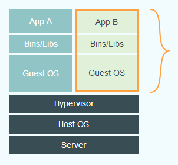
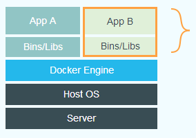

# Docker

<hr>

#### Docker란
- 리눅스 서버를 손쉽게 패키징하고, 배포할 수 있도록 해주는 플랫폼
- Docker는 지금까지 사용해왔던 가상 머신과 비슷
<br>

&nbsp;&nbsp;&nbsp;&nbsp;&nbsp;&nbsp;&nbsp;&nbsp;&nbsp;&nbsp; 
##### &nbsp;&nbsp;&nbsp;&nbsp;&nbsp;&nbsp;&nbsp;&nbsp;&nbsp;&nbsp;&nbsp;&nbsp;&nbsp;&nbsp;&nbsp;&nbsp;&nbsp;&nbsp;&nbsp;&nbsp;가상머신&nbsp;&nbsp;&nbsp;&nbsp;&nbsp;&nbsp;&nbsp;&nbsp;&nbsp;&nbsp;&nbsp;&nbsp;&nbsp;&nbsp;&nbsp;&nbsp;&nbsp;&nbsp;&nbsp;&nbsp;&nbsp;&nbsp;&nbsp;&nbsp;&nbsp;&nbsp;&nbsp;&nbsp;&nbsp;&nbsp;&nbsp;&nbsp;&nbsp;&nbsp;&nbsp;&nbsp;&nbsp;&nbsp;&nbsp;&nbsp;&nbsp;&nbsp;&nbsp;&nbsp;&nbsp;&nbsp;&nbsp;&nbsp;&nbsp;&nbsp;&nbsp;&nbsp;&nbsp;&nbsp;&nbsp;&nbsp;&nbsp;&nbsp;&nbsp;&nbsp;&nbsp;&nbsp;&nbsp;&nbsp;Docker

Guest OS를 생략시킴으로써 경량화시켜 이미지 용량이 크게 줄어듬 그리고 가상화 레이어가 없기 때문에 파일시스템, 네트워크 속도도 가상 머신에 비해 월등히 빠르다는 장점이 있다. (호스트와 거의 동일한 속도)
<br>
<hr>
#### 리눅스 컨테이너
OS를 통째로 가상화하는 것이 아닌 리눅스 커널 레벨에서 제공하는 일종의 격리(Isolate)된 가상 공간
OS가 설치되지 않기 때문에 가상 머신이라고 하지 않고, 컨테이너라고 부름


#### Docker 이미지와 컨테이너
- <b>이미지</b>
    필요한 프로그램과 라이브러리, 소스를 설치한 뒤 파일로 만든 것
    이 이미지를 저장소에 올리고, 받을 수 있음
- <b>컨테이너</b>
    이미지를 실행한 상태.
    이미지로 여러개의 컨테이너를 만들 수 있음
<br>

    운영체제로 보면
    <b>이미지</b>&nbsp;&nbsp;&nbsp;&nbsp;&nbsp;→&nbsp;&nbsp;실행파일
    <b>컨테이너</b>&nbsp;&nbsp;→&nbsp;&nbsp;프로세서 


<hr>

#### Setup

- Windows
    https://docs.docker.com/docker-for-windows/install/

- Linux
    `curl -fsSL https://get.docker.com/ | sudo sh` 
    <br>
    sudo 없이 사용하기 (Docker는 기본적으로 root 권한이 필요)
    ```
    $ sudo usermod -aG docker $USER # 현재 접속중인 사용자에게 권한주기
    $ sudo usermod -aG docker your-user # your-user 사용자에게 권한주기

    $ docker version
    
    Client: Docker Engine - Community
    Version:           20.10.7
    API version:       1.41
    Go version:        go1.13.15
    Git commit:        f0df350
    Built:             Wed Jun  2 11:56:47 2021
    OS/Arch:           linux/amd64
    Context:           default
    Experimental:      true
    Got permission denied while trying to connect to the Docker daemon socket at unix:///var/run/docker.sock: Get http://%2Fvar%2Frun%2Fdocker.sock/v1.24/version: dial unix /var/run/docker.sock: connect: permission denied
    ```
<hr>

#### How Tos
<br>

##### 기본명령어 
- <b>search</b>
    Docker는 Docker Hub를 통해 이미지를 공유하는 생태계가 구축되어 있다.
    search 명령으로 Docker Hub에서 이미지를 검색
    ```
    $ sudo docker search ubuntu

    NAME                                                      DESCRIPTION                                     STARS     OFFICIAL   AUTOMATED
    ubuntu                                                    Ubuntu is a Debian-based Linux operating sys…   12545     [OK]
    dorowu/ubuntu-desktop-lxde-vnc                            Docker image to provide HTML5 VNC interface …   555                  [OK]
    websphere-liberty                                         WebSphere Liberty multi-architecture images …   276       [OK]
    rastasheep/ubuntu-sshd                                    Dockerized SSH service, built on top of offi…   254                  [OK]
    consol/ubuntu-xfce-vnc                                    Ubuntu container with "headless" VNC session…   241                  [OK]
    ubuntu-upstart                                            Upstart is an event-based replacement for th…   113       [OK]
    neurodebian                                               NeuroDebian provides neuroscience research s…   84        [OK]
    1and1internet/ubuntu-16-nginx-php-phpmyadmin-mysql-5      ubuntu-16-nginx-php-phpmyadmin-mysql-5          50                   [OK]
    open-liberty                                              Open Liberty multi-architecture images based…   47        [OK]
    ubuntu-debootstrap                                        debootstrap --variant=minbase --components=m…   44        [OK]
    i386/ubuntu                                               Ubuntu is a Debian-based Linux operating sys…   25
    nuagebec/ubuntu                                           Simple always updated Ubuntu docker images w…   24                   [OK]
    solita/ubuntu-systemd                                     Ubuntu + systemd                                24                   [OK]
    1and1internet/ubuntu-16-apache-php-5.6                    ubuntu-16-apache-php-5.6                        14                   [OK]
    1and1internet/ubuntu-16-apache-php-7.0                    ubuntu-16-apache-php-7.0                        13                   [OK]
    1and1internet/ubuntu-16-nginx-php-phpmyadmin-mariadb-10   ubuntu-16-nginx-php-phpmyadmin-mariadb-10       11                   [OK]
    1and1internet/ubuntu-16-nginx-php-5.6-wordpress-4         ubuntu-16-nginx-php-5.6-wordpress-4             9                    [OK]
    1and1internet/ubuntu-16-apache-php-7.1                    ubuntu-16-apache-php-7.1                        7                    [OK]
    darksheer/ubuntu                                          Base Ubuntu Image -- Updated hourly             5                    [OK]
    1and1internet/ubuntu-16-nginx-php-7.0                     ubuntu-16-nginx-php-7.0                         4                    [OK]
    1and1internet/ubuntu-16-nginx-php-7.1-wordpress-4         ubuntu-16-nginx-php-7.1-wordpress-4             3                    [OK]
    1and1internet/ubuntu-16-php-7.1                           ubuntu-16-php-7.1                               1                    [OK]
    smartentry/ubuntu                                         ubuntu with smartentry                          1                    [OK]
    1and1internet/ubuntu-16-sshd                              ubuntu-16-sshd                                  1                    [OK]
    1and1internet/ubuntu-16-rspec                             ubuntu-16-rspec                                 0                    [OK]
    ```

- <b>pull</b>
    이미지를 받기
    ```
    $ sudo docker pull ubuntu:latest

    latest: Pulling from library/ubuntu
    16ec32c2132b: Pull complete
    Digest: sha256:82becede498899ec668628e7cb0ad87b6e1c371cb8a1e597d83a47fac21d6af3
    Status: Downloaded newer image for ubuntu:latest
    docker.io/library/ubuntu:latest
    ```

- <b>images</b>
    받은 이미지 목록 출력
    ```
    $ sudo docker images

    REPOSITORY   TAG       IMAGE ID       CREATED        SIZE
    ubuntu       latest    1318b700e415   34 hours ago   72.8MB
    ```

- <b>run</b>
    이미지를 컨테이너로 생성한 뒤 Bash Shell을 실행
    docker run <옵션> <이미지 이름> <실행할 파일>
    ```
    $ sudo docker run -i -t --name hello ubuntu /bin/bash
    
    root@95715b464682:/#
    ```

- <b>ps</b>
    모든 컨테이너 목록을 출력
    ```
    $ sudo docker ps -a            # -a옵션 정지된 컨테이너까지 모두 출력

    CONTAINER ID   IMAGE     COMMAND       CREATED         STATUS                    PORTS     NAMES
    95715b464682   ubuntu    "/bin/bash"   4 minutes ago   Exited (0) 1 second ago             hello
    ```

- <b>start</b>
    정지한 컨테이너를 다시금 시작
    ```
    $ sudo docker start hello        # 이름대신 컨테이너 ID로 사용가능

    hello
    ```

- <b>restart</b>
    컨테이너를 재시작
    ```
    $ sudo docker restart hello        # 이름대신 컨테이너 ID로 사용가능

    hello
    ```

- <b>attach</b>
    시작한 컨테이너에 접속
    ```
    $ sudo docker attach hello

    root@95715b464682:/#          #  exit or Ctrl + D로 빠져나오기
    ```

- <b>exec</b>
    현재 컨테이너가 실행중인 상태에서 /bin/bash를 통하지 않고 외부에서 컨테이너 안의 명령을 실행
    docker exec <컨테이너 이름> <명령> <매개 변수>
    ```
    $ sudo docker exec hello echo "Hello World"

    Hello World
    ```

- <b>stop</b>
    컨테이너를 정지
    ```
    $ sudo docker ps
    CONTAINER ID   IMAGE     COMMAND       CREATED          STATUS         PORTS     NAMES
    95715b464682   ubuntu    "/bin/bash"   42 minutes ago   Up 2 minutes             hello

    $ sudo docker stop hello
    hello
    
    $ sudo docker ps
    CONTAINER ID   IMAGE     COMMAND   CREATED   STATUS    PORTS     NAMES
    ```
- <b>rm</b>
    생성된 컨테이너를 삭제
    ```
    $ sudo docker rm hello
    ```

- <b>rmi</b>
    이미지삭제
    ```
    $ sudo docker rmi ubuntu:latest

    Untagged: ubuntu:latest
    Untagged: ubuntu@sha256:82becede498899ec668628e7cb0ad87b6e1c371cb8a1e597d83a47fac21d6af3
    Deleted: sha256:1318b700e415001198d1bf66d260b07f67ca8a552b61b0da02b3832c778f221b
    Deleted: sha256:7555a8182c42c7737a384cfe03a3c7329f646a3bf389c4bcd75379fc85e6c144
    ```

##### 이미지 생성하기
 - Dockerfile
 Docker 이미지 설정 파일

    ```
    $ mkdir example && cd example
    $ vi Dockerfile
    ```

    `example/Dockerfile`
    ```
    FROM ubuntu:16.04                                                  # FROM 어떤 이미지를 기반으로 할지 설정
    MAINTAINER Foo Bar <foo@bar.com>                                   # 메인테이너 정보

    RUN apt-get update                                                 # shell 스크립트 또는 명령을 실행
    RUN apt-get install -y nginx
    RUN echo "\ndaemon off;" >> /etc/nginx/nginx.conf
    RUN chown -R www-data:www-data /var/lib/nginx

    VOLUME ["/data", "/etc/nginx/site-enabled", "/var/log/nginx"]     # 호스트와 공유할 디렉토리 목록

    WORKDIR /etc/nginx

    CMD ["nginx"]                                                    # 컨테이너가 시작되었을 때 실행 파일 또는 스크립트

    EXPOSE 80                                                        # 호스트와 연결할 포트 번호
    EXPOSE 443
    ```

 - bulid
 Dockerfile을 기반으로 이미지를 생성
 docker build <옵션> <Dockerfile 경로>
    ```
    sudo docker build --tag hello:0.1 .

    Sending build context to Docker daemon  2.048kB
    Step 1/11 : FROM ubuntu:16.04
    16.04: Pulling from library/ubuntu
    528184910841: Pull complete
    8a9df81d603d: Pull complete
    636d9303bf66: Pull complete
    672b5bdcef61: Pull complete

    ... 생략

    Successfully built 81e5754efd7e
    Successfully tagged hello:0.1

    # 생성된 이미지 실행
    sudo docker run --name hello-nginx -d -p 80:80 -v /root/data:/data hello:0.1
    # -d → 컨테이너를 백그라운드로 실행
    # -p 80:80 → 호스트의 80포트와 컨테이너의 80포트를 연결하고 외부에 노출
    # -v /root/data:/data  → /root/data 디렉터리를 컨테이너의 /data 디렉터리에 연결

    3be136ff625c4923127a39ef10e1e2442bb1030fd8c957418565fc529d788193

    $ sudo docker ps
    CONTAINER ID   IMAGE       COMMAND   CREATED         STATUS         PORTS                                        NAMES
    3be136ff625c   hello:0.1   "nginx"   5 minutes ago   Up 5 minutes   0.0.0.0:80->80/tcp, :::80->80/tcp, 443/tcp   hello-nginx
 ```
